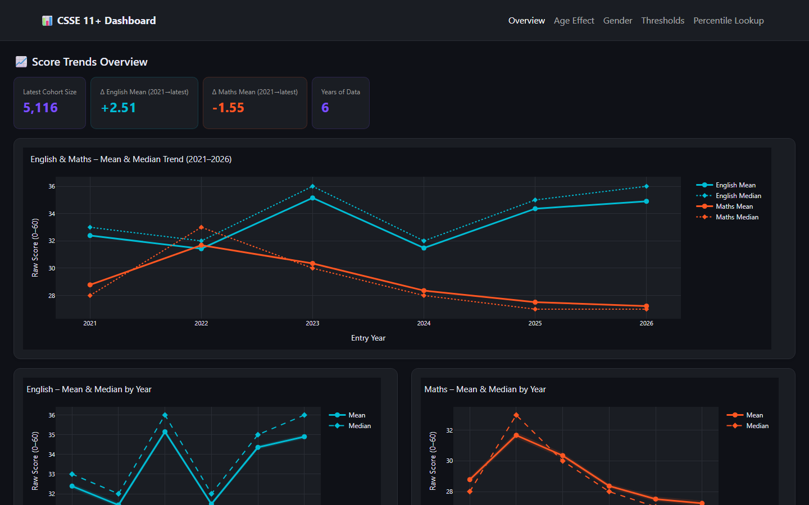

# CSSE 11+ Analysis Dashboard

This repository contains a Python dashboard for exploring publicly available Consortium of Selective Schools in Essex (CSSE) 11+ raw score data.

The CSSE administers the 11+ entrance examination used by selective schools in Essex. Candidates sit English and Mathematics papers, and CSSE publishes anonymised score datasets and standardisation reports through its Freedom of Information resources.



## Data

The raw score, standardised score, historical guidance, and standardisation report files are available free from the CSSE website:

- [CSSE Freedom of Information resources](https://csse.org.uk/freedom-of-information/)
- [CSSE 11+ examination information](https://csse.org.uk/examination/)

The source data files are not committed to this repository. Download the relevant public files from CSSE and place them in the repository root before running the data preparation script.

Expected raw files for the current Python workflow:

- `2021-Entry-raw-scores-sorted-by-gender-and-month-of-birth-FINAL.xlsx`
- `2022_FOR-PUBLICATION-RAW-SCORES-BY-GENDER-AND-BIRTH-MONTH-1-1.csv`
- `Raw-Scores-for-2023-Entry-for-publication-.csv`
- `Raw-scores-for-2024-Entry.csv`
- `Raw-scores-for-2025-Entry.csv`
- `Raw-scores-for-2026-Entry.csv`

## Setup

```powershell
python -m venv .venv
.\.venv\Scripts\Activate.ps1
python -m pip install -r requirements.txt
```

## Prepare The Data

```powershell
python .\csse_Py_analysis\csse_data_prep.py
```

This creates `csse_cleaned.csv` in the repository root. That generated CSV is ignored by Git.

If your data files live somewhere else, set `CSSE_DATA_DIR` before running either script:

```powershell
$env:CSSE_DATA_DIR = "C:\path\to\csse\data"
```

## Run The Dashboard

```powershell
python .\csse_Py_analysis\csse_dashboard.py
```

Then open [http://127.0.0.1:8050](http://127.0.0.1:8050).

The dashboard includes:

- year-by-year English and Maths score trends
- age group comparisons by birth month
- gender comparisons
- threshold analysis for scores at or above 40 and 50
- a percentile lookup tool

## Repository Policy

This repo intentionally commits only the Python dashboard code and project documentation. Raw data files, cleaned CSV outputs, PDFs, Excel workbooks, and the R analysis folder are ignored.
